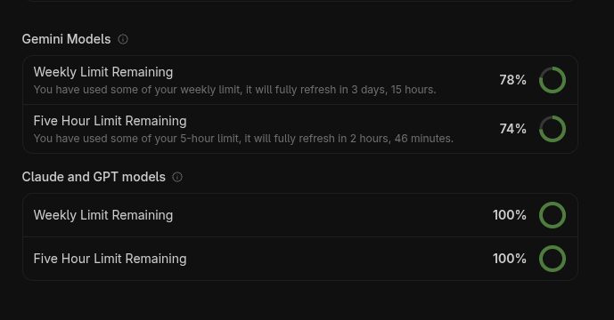

# Antigravity Tracker

A GNOME Shell extension that displays your [Antigravity](https://antigravity.google) AI usage quotas in the top bar.



## Features

- **Top bar indicator** — system monitor icon in the GNOME Shell panel
- **Quota dashboard** — click to see remaining usage for all model groups:
  - **Gemini Models** (Flash, Pro) — weekly & 5-hour limits
  - **Claude and GPT models** (Opus, Sonnet, GPT-OSS) — weekly & 5-hour limits
- **Circular progress rings** — color-coded: green (>50%), amber (25–50%), red (<25%)
- **Auto-discovery** — automatically finds the running Antigravity language server
- **Periodic refresh** — polls every 2 minutes; also refreshes on menu open

## Requirements

- **Fedora 44** (or any distro with GNOME Shell 48–50)
- **Antigravity** desktop app or `agy` CLI running

## Installation

### Development (symlink)

```bash
chmod +x scripts/install.sh
./scripts/install.sh
```

This creates a symlink from the project directory into `~/.local/share/gnome-shell/extensions/` and enables the extension.

### Manual

```bash
# Copy to extensions directory
cp -r . ~/.local/share/gnome-shell/extensions/antigravity-tracker@mindslost.com/

# Enable
gnome-extensions enable antigravity-tracker@mindslost.com
```

### After installing

On Wayland (Fedora 44 default), you need to **log out and back in** for the extension to load. Alternatively, test with a nested session:

```bash
MUTTER_DEBUG_DUMMY_MODE_SPECS=1920x1080 dbus-run-session gnome-shell --nested --wayland
```

## How It Works

The extension auto-discovers the Antigravity language server by:

1. Scanning `/proc` for `language_server` processes
2. Extracting the `--csrf_token` from the process command line
3. Probing loopback TCP ports to find the Connect-RPC HTTPS endpoint
4. Querying `RetrieveUserQuotaSummary` for quota data

All communication stays local (`127.0.0.1`) — no data leaves your machine.

## Debugging

```bash
# View GNOME Shell logs
journalctl -f -o cat /usr/bin/gnome-shell

# Check extension status
gnome-extensions info antigravity-tracker@mindslost.com

# Disable
gnome-extensions disable antigravity-tracker@mindslost.com
```

## Project Structure

```
├── metadata.json      # Extension manifest
├── extension.js       # Main extension logic
├── stylesheet.css     # Custom styling
├── scripts/
│   └── install.sh     # Development installer
└── README.md          # This file
```

## License

MIT
